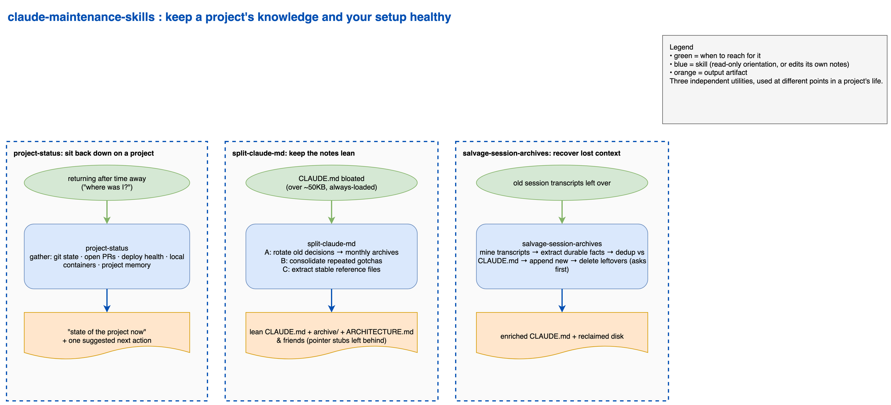

# Claude Code maintenance skills

Three Claude Code skills for keeping a project's knowledge and your Claude Code setup healthy over time: orient yourself when you come back to a project, keep its `CLAUDE.md` from bloating, and recover anything useful left behind in old session transcripts.

Each skill is a self-contained directory (a `SKILL.md`). Claude can invoke one when its description matches what you are doing, or you can ask for it by name.

## When each one runs



Source: [docs/maintenance-flow.drawio](docs/maintenance-flow.drawio) (editable in draw.io).

## The skills

- **`project-status`** — cold-start orientation for a project. Gathers git state, open PRs, deploy health, local container status, OpenSpec change progress, unresolved spec-review blockers, and pending items from project memory, then synthesizes a "what is the state of this project right now" report and suggests one next action. Read-only; it never mutates git, the deploy, or your files. Use it when you sit back down on a project after time away.
- **`split-claude-md`** — three-phase `CLAUDE.md` maintenance. Phase A rotates old dated decision-log entries into monthly archive files and builds an index with a grep-pattern navigation header. Phase B consolidates recurring failure patterns (two or more instances) into a single "Known Patterns & Gotchas" section with instance counts. Phase C extracts stable reference sections (architecture, file maps, data layouts) into standalone files (`ARCHITECTURE.md`, `DEVELOPMENT.md`, and so on) with one-line pointer stubs left in `CLAUDE.md`. The goal is to keep the always-loaded `CLAUDE.md` lean. Each phase is skippable; the default runs all three.
- **`salvage-session-archives`** — mine the Claude Code session-transcript leftover folders for a project, extract durable facts, decisions, and gotchas that never made it into the project's `CLAUDE.md`, cross-check them against what is already documented (duplicates and contradictions), append the genuinely new items under a "Salvaged from session archives" section, then delete the leftover folders. Recovers lost context and cleans up disk in one pass. It asks before deleting anything.

## Install

Each subdirectory here is a self-contained skill. Copy or symlink the skill directories into your `~/.claude/skills/` so Claude Code picks them up:

```bash
cp -R claude-maintenance-skills/project-status \
      claude-maintenance-skills/split-claude-md \
      claude-maintenance-skills/salvage-session-archives \
      ~/.claude/skills/
```

## Assumptions

These skills assume the standard Claude Code layout: a per-project data directory at `~/.claude/projects/<X>/` holding an optional `CLAUDE.md` and a `memory/` folder, and the dash-encoded transcript "leftover folders" Claude Code creates under `~/.claude/projects/`. All paths derive from `$HOME`, so the skills work on any machine without editing. `project-status` also reads a repo-root `CLAUDE.md` when one exists.

## Optional integrations (not bundled)

`project-status` checks several things when the tool or file is present and skips them silently otherwise. None are required:

- `git` and the GitHub CLI (`gh`) for branch state and open PRs.
- A deploy host (for example Render) and local Docker, for deploy and container health.
- OpenSpec for change-progress tracking; it is a separately installed tool (`npm install -g @fission-ai/openspec`) and `project-status` will suggest `/opsx:apply` only when an OpenSpec change with open tasks exists.
- A `COMMENTS.md` spec-review file, read for unresolved blockers when one is present.

The session-lifecycle skills that pair naturally with these (`save-context`, `close-session`, `todo`, `new-session`) live in the separate multi-phase-skills-framework pack, so they are not duplicated here.

## Conventions

- `project-status` and `salvage-session-archives` (before its final confirmed deletion) are read-only orientation passes. `split-claude-md` restructures `CLAUDE.md` locally and does not commit or push.
- Writing follows plain-prose conventions: no em dashes, no marketing adjectives, no Unicode box-drawing characters in tables.

## License

MIT. See [LICENSE](LICENSE).
